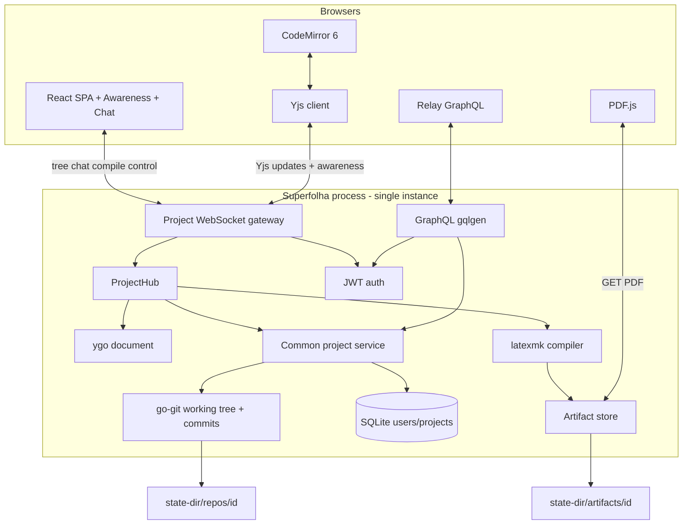

# Superfolha Product & Architecture Spec

| Field | Value |
|-------|-------|
| **Title** | Superfolha Product & Architecture Spec |
| **Status** | Draft (post grill) |
| **Date** | 2026-07-16 |
| **Repo** | `/home/lucasew/WORKSPACE/OPENSOURCE-own/superfolha` (existing product; collab re-architecture) |
| **Audience** | Engineers implementing Superfolha |
| **Related** | Sibling collab patterns in `../gaderno` (ygo + Yjs, session fence, server-king) |

This document is the **product and architecture specification**. It merges the original Superfolha technical checklist with the live-collaboration CRDT model. It is not a style guide.

---

## Overview

**Superfolha** is a web-based LaTeX editor: multi-file projects, Git version history, TeX → PDF compilation, accounts (JWT), and a React SPA. The product direction is **live multi-client co-editing** of a project — several tabs (and, when project ACL allows, several users) share one live document.

The live document is a **Yjs-compatible CRDT** held in server memory via **[ygo](https://github.com/reearth/ygo)** (pure Go). Clients use **Yjs** + CodeMirror for optimistic text. On disk there is **only the project Git repository** (working tree + history) for project files, plus **SQLite** for users/projects metadata and an **artifacts** directory for compile outputs. **No CRDT sidecar files.** If the server dies before changes are acked and flushed, unacked client speculation is gone; last flush may lag.

**One project = one Git repo = one live hub / one Y.Doc** (when a session is open).

---

## Background & Motivation

Classic Superfolha is a **request/response** editor: GraphQL `saveFile`, client debounce, auto-commit, `POST /api/compile` with a client-built tarball. That works for solo edit but is a poor multi-client merge model (last-write-wins on whole files, no shared cursors, compile races with unsaved peers).

Sibling project **gaderno** already proved the shape we want: server-owned ygo, browser Yjs, single WebSocket, session identity fence, “Synced = server ack.” Superfolha applies the same ideas to a **multi-file LaTeX + Git** product instead of a single `.ipynb`.

Prior art: Overleaf (collab LaTeX), Yjs/y-websocket, gaderno, CodeMirror 6 collab bindings.

---

## Goals & Non-Goals

### Goals (v1 / target architecture)

1. **Live multi-client co-editing** of a LaTeX project (text merge + shared awareness + session chat).
2. **Server is king:** ygo is canonical live state for text; clients are followers except optimistic text speculation.
3. **CRDT in server RAM** via **ygo**; browser **Yjs** speaks the same update protocol.
4. **One WebSocket per project hub** for CRDT, awareness, chat, tree events, compile control.
5. **HTML forms for non-live** work: auth, project list/CRUD; live editor stays on the project WebSocket.
6. **Git** remains the durable, user-visible VCS for project files (working tree + commits).
7. **Compile** via existing **`GET /api/compile`**, after hub flush when live; project files from working tree (not client tarball). Artifacts-outside-git remains allowed for aux/last-PDF caching.
8. **Same access boundary** for project APIs and the CRDT stream (whoever may open the project may join the hub).
9. **Single-instance** process model; hubs live in that process only.
10. **Accounts** stay (JWT register/login); not gaderno’s token-only model.
11. Existing product surface remains: file tree, CM LaTeX editor, PDF.js viewer, autocomplete, DaisyUI UI, embedded SPA binary.
12. **Postgres dual-driver:** emit a **deprecation warning** when selected; direction is SQLite-only.

### Non-Goals (v1)

- Multi-replica live collab / shared CRDT store (Redis, y-sweet, etc.).
- Durable CRDT snapshots or op-log sidecars on disk.
- Anchored comments / review threads.
- Fine-grained path ACLs (whole-project access only).
- Multi-user project sharing UI (v1 ACL stays **owner-only**; stream rule is ready when sharing lands).
- P2P / offline-first mesh.
- Client-built tarball compile (never the model; server always reads project files).
- Pixel-perfect Overleaf clone.

### Later (do not paint into a corner)

- Project sharing (invite list / links); stream access still = project access.
- Remove postgres package entirely.
- Durable CRDT snapshot / history / time-travel.
- File watcher for external disk edits while hub is live.
- WS tickets if reverse proxies force it.
- Path-level permissions.

---

## Decisions from grill (normative)

| # | Decision |
|---|----------|
| 1 | Product = **live multi-client co-editing** (solo = one peer). |
| 2 | **One Y.Doc / hub per project** (not per file). |
| 3 | **CRDT is RAM-only**; **Git is the sole on-disk projection** of project files. |
| 3b | **Session identity fence** (gaderno-style): hub `session_id`; WS starts with `hello` only; client `sessionStorage`; mismatch → reload, never sync first; server rejects CRDT/control until `hello.ack`. |
| 4 | **Stream access = project access** — no separate CRDT capability. |
| 5 | **v1 project ACL** = today’s owner-only; multi-user sharing later without redesigning the stream gate. |
| 6 | **Write model like gaderno:** speculate on **text**; server may reject; compile/git/blob bytes are server-mediated. |
| 7 | Library = **ygo + Yjs** (same as gaderno). |
| 8 | **Live = project WebSocket**; **non-live = HTML forms + REST compile/upload/download**. |
| 9 | **Single-instance** Superfolha; one process owns all hubs. |
| 9b | **Postgres deprecated** — log a deprecation warning when the postgres driver is used; target SQLite. |
| 10 | **File tree truth = Git working tree** (list paths from disk projection). |
| 11 | **CRDT holds text file bodies only** (`Y.Text` keyed by path). |
| 12 | **Blobs are outside the CRDT** — normal files in the Git repo; upload/replace/delete via server path. |
| 13 | **Awareness + RAM session chat** (project-scoped, dies with hub). No comment threads. |
| 14 | **Flush-before-compile** (all text Y.Texts → working tree, then latexmk). |
| 15 | **Hub-owned debounced auto-commit** + optional explicit commit. |
| 16 | **Always finish flush before commit**; **lock CRDT sync while commit runs**. |
| 17 | GraphQL and WS hit a **common code path** (no dual independent writers). |
| 18 | Hub created on **first project WS connect**; **idle-evict** after zero clients (flush + finish in-flight commit first). |
| 19 | WS auth = **same JWT session** as HTTP (cookie `authToken` and/or `Authorization: Bearer`). |
| 20 | Compile stays **`GET /api/compile`** (today’s endpoint). When a hub is live, the handler **flushes** ygo text first (same flush-before-compile rule), then runs latexmk. Response remains JSON (`pdf`/`logs`/`synctex`/`success`); PDF may stay base64 in-body for the existing editor, with optional later move to artifact URL. **Not** a client tarball upload. |
| 21 | Auto-commit **Git author** = **project owner email**. |
| 22 | **Text vs blob** = existing rules (`HasBinary` / extension denylist + content sniff). |
| 23 | **Oversized text** (cap ~5 MB, same order as `MaxGraphQLFileSize`): do **not** load full body into CRDT; non-collaborative / warn. |
| 24 | Awareness identity = **account email (or local-part) + color**. |
| 25 | **Compile artifacts outside the Git repo** (artifact store under state-dir). |
| 26 | SPEC language = **English**. |
| 27 | While hub is live, **hub owns the tree**; **ignore external disk/git CLI writes** (no watcher in v1). |
| 28 | Timer defaults: text flush debounce **~1–2 s**; auto-commit quiet **~30 s**; hub idle **~30 m**; client ack-wait before compile **~500 ms** then warn. Configurable later. |

---

## Vocabulary

| Term | Meaning |
|------|---------|
| **Project** | DB row + Git repo at `{state-dir}/repos/{projectId}` + optional live hub. |
| **Hub** | Per-project actor: ygo doc, client set, serialize mutations, compile, commit lock, chat buffer. |
| **Session id** | UUID for one hub lifetime. Clients compare on reconnect; mismatch ⇒ hard page reset. |
| **Server ack** | Update accepted into server ygo (and will be relayed). Powers “Synced” UI. |
| **Flush** | Project all in-CRDT text bodies onto the Git working tree (and ensure blob files already on disk). |
| **Disk / Git projection** | Working tree + commits. Not what “Synced” means. |
| **Artifact store** | Compile PDF/logs/synctex **outside** the Git repo. |
| **Text file** | Classified non-binary by `HasBinary`; body may live in `Y.Text` if under size cap. |
| **Blob file** | Binary (or oversize text treated as non-collab); bytes only on disk/Git. |
| **Common code path** | Shared service used by GraphQL resolvers and WS handlers for tree/blob/commit/compile setup. |
| **Seam** | Boundary where adapters swap (`CRDTDoc`, `ProjectStore`, `Compiler`). |

---

## Stack (normative + current code)

### Backend

| Piece | Choice |
|-------|--------|
| Language | Go (`github.com/lewtec/superfolha`) |
| HTTP | stdlib `ServeMux` |
| API (non-live) | HTML forms + 303 (templ); REST compile/upload/download |
| DB | **SQLite** (`modernc.org/sqlite`) + sqlc; migrations on boot |
| DB (legacy) | Postgres driver still present → **deprecation warning** when selected |
| Git | **go-git** (not libgit2; older drafts were wrong) |
| CLI | **cobra** |
| Frontend embed | `embed.FS` / release tags for Vite dist |
| CRDT | **ygo** (server), **Yjs** (browser) |
| Compile | **latexmk** on PATH (`-pdf`, batchmode); TeX Live in Docker |

### Frontend

| Piece | Choice |
|-------|--------|
| UI | templ pages + one bun-built JS island |
| Live | Yjs + CodeMirror 6 binding (`y-codemirror` or equivalent) |
| UI kit | DaisyUI 5 + Tailwind 4 |
| PDF | Browser PDF engine (blob iframe) |
| Routing | Server routes (`internal/paths`) |
| i18n | go-i18n (en/es/pt) |

### Deploy

- Single binary embedding frontend (release build).
- Docker: TeX Live base + binary; volume for `{state-dir}`.
- Platforms: Render / Railway style single instance + disk (see `render.yaml`, `railway.toml`).
- **Do not** run multiple live instances of the same project hubs without a future redesign.

---

## Proposed Design

### High-level architecture



### Authority model

```text
                    ┌──────────────────────────────────────────┐
                    │              SERVER (king)               │
                    │  ygo text · hub · git flush/commit       │
                    │  sole writer: compile status/logs refs   │
                    │  sole writer: blob bytes on disk         │
                    │  may reject client CRDT / structure ops  │
                    └──────────────────────────────────────────┘
                                       ▲
                         CRDT updates / acks / control
                                       │
                    ┌──────────────────────────────────────────┐
                    │              CLIENT (follower)           │
                    │  optimistic Y.Text in CodeMirror         │
                    │  requests: tree ops, upload, compile     │
                    │  never invents PDF/logs as truth         │
                    └──────────────────────────────────────────┘
```

**Speculate on text only.** Keystrokes apply locally via Yjs. Server ygo merges and acks → **“Synced.”** Structure/blob/compile/commit are server-mediated (may be requested over WS or GraphQL, but always through the **common code path** / hub when live).

| Concern | In Y.Doc? | Who writes |
|---------|-----------|------------|
| Text file body | Yes (`Y.Text` per path) | Clients propose; server may reject |
| File tree listing | **No** (disk/Git) | Server after tree ops; fan-out `tree` events |
| Blob bytes | **No** | Server on upload; disk/Git only |
| Compile logs/status | Optional side messages | **Server only** |
| PDF | **No** (HTTP artifact) | **Server only** |
| Git commit | **No** | **Server only** (hub debounce or explicit) |
| Awareness | Awareness protocol | Clients |
| Chat | **Not** in Y.Doc | Server RAM buffer; WS fan-out |

### 1. Project & process model

- **Single process** holds a map of live hubs keyed by `projectId`.
- **Hub open:** first authenticated WS connect for that project that passes project ACL.
- **Hub join:** further clients attach to the same ygo + `session_id`.
- **Hub idle-evict (~30 m, zero clients):** flush text → tree; finish in-flight debounced commit if any; drop ygo; free memory. Next connect mints a **new** `session_id` (fence reload for old tabs).
- **No multi-instance hub routing** in v1.

### 2. Document model (ygo / Yjs)

Canonical live text state is a **Y.Doc** on the server (ygo). Browser holds a replica for text.

#### Suggested schema (v1)

```text
Y.Doc
  meta: Y.Map              # optional project live meta (schema version, etc.)
  # Text bodies only — one Y.Text per collaborative text path:
  # key convention: "text:" + relative path  (or GetText(path) seam)
  text:<relpath>: Y.Text
```

**Not in Y.Doc:** path arrays for the whole tree, blob contents, PDF, git hashes, chat.

#### Load on hub create

1. Open Git working tree for `projectId`.
2. Walk files (respect path jail; skip `.git`).
3. For each path:
   - If **blob** (`HasBinary`) → leave on disk only; include in tree snapshot.
   - If **text** and size ≤ cap (~5 MB) → create/replace `Y.Text` from file bytes (UTF-8).
   - If **text** but oversize → tree entry marked non-collaborative; no full `Y.Text` (or empty + warning policy).
4. Origin tag e.g. `superfolha.load` for transactions.

#### Project text → disk (flush)

For every path with a `Y.Text` in the doc, write current string to the working tree path (create parents as needed). Do not delete blob files during text flush. Tree-delete ops explicitly remove paths.

#### Text vs blob classification

Reuse existing server rules (keep frontend denylist in spirit):

- Known **binary extensions** win (images, pdf, archives, fonts, av, …).
- Else content sniff (`http.DetectContentType` / non-text) as today.
- **Cap:** refuse full CRDT residency above ~5 MB.

### 3. Sync protocol

**One WebSocket** per tab per open project, e.g. `GET /ws/projects/{id}` after JWT auth.

#### Frame types (logical)

| Kind | Direction | Role |
|------|-----------|------|
| `hello` | s→c | **First** frame: `{ session_id, client_id, project_id }`. No CRDT yet. |
| `hello.ack` | c→s | Client accepts this `session_id`. Server marks peer Ready. |
| `yjs` / binary | both | Yjs update / sync step / awareness |
| `tree.snapshot` | s→c | Full path list after Ready (path, kind text\|blob, size, collab flag, …) |
| `tree.event` | s→c | create / delete / rename / blob-replaced |
| `file.create` / `file.delete` / `file.rename` / `blob.upload`… | c→s | Structure/blob requests (or binary upload protocol) |
| `compile.event` | s→c | **Optional** fan-out when a peer compiles via HTTP (status/busy); not required for MVP if only the caller sees `/api/compile` response |
| `chat.send` / `chat.message` / `chat.history` | both | Session chat |
| `commit.now` | c→s | Optional explicit commit (still flush + lock) |
| `sync.status` | s→c | optional explicit synced / committing / flushing |
| `error` | s→c | actionable errors |
| `ping`/`pong` | both | keepalive |

Prefer **binary WS frames** for Yjs; JSON text frames for control.

#### Session fence (normative, gaderno-compatible)

1. WS open → authenticate JWT (cookie or Bearer) → authorize project access.
2. Server sends **only `hello`** (`session_id`, `client_id`). Peer is **not Ready**.
3. Client compares `session_id` to `sessionStorage` key for this project id:
   - **missing** → store; send `hello.ack`; attach Yjs.
   - **same** → `hello.ack`; attach Yjs (may push unacked local text).
   - **different** → store new id; close WS; **`location.reload()`**. Do **not** ack or send CRDT.
4. On `hello.ack`, server marks Ready; sends Yjs sync + `tree.snapshot` + chat tail. Until Ready, **drop** that peer’s binary sync and control (including awareness).

#### “Saving…” / “Synced” / “Committing…”

- **Dirty / Saving…** — local text not yet server-acked.
- **Synced** — server has acknowledged updates into ygo. **Not** disk fsync, **not** git commit.
- **Committing…** — hub holds **CRDT sync lock**; peers should not expect live merges until unlock.
- Disk flush failures → separate warning (“Disk write failed”), do not reclaim Synced.
- Git commit failures → error; unlock sync; leave working tree as flushed.

### 4. Source editing

- CodeMirror 6 + LaTeX mode (existing) bound to path’s `Y.Text` when file is collab text.
- Local apply immediate (≤16 ms feel).
- Blob files → binary viewer / upload replace (existing UX), not CM+Yjs.
- **Flush-before-compile:** hub flushes all text; client should await ack of pending local updates (~500 ms timeout → warn/abort compile).
- Editor hosts must not be destroyed by unrelated DOM thrash while bound.

### 5. Auth / identity / access

- **Accounts:** register/login, bcrypt, JWT (~7 day TTL as today).
- Cookie: `authToken` HttpOnly; also accept `Authorization: Bearer`.
- GraphQL and WS use the **same** session resolution middleware.
- **Project access (v1):** owner only (`projects.user_id`).
- **Stream access:** identical check on WS upgrade / hub join.
- Awareness: display **email or local-part** + assigned color; not a security boundary.

### 6. Storage layout

```text
{state-dir}/
  superfolha.db              # SQLite (default path if --db unset)
  repos/
    {projectId}/             # one Git repository per project
      .git/
      main.tex
      ...
  artifacts/
    {projectId}/             # compile outputs — NOT in git
      out.pdf                # or main.pdf; implementer picks stable names
      latex.log
      ...
```

- **Load hub:** working tree → ygo text map.
- **Flush:** ygo text → working tree (debounce ~1–2 s after activity; **immediate** before compile/commit).
- **Commit:** flush → lock CRDT sync → `git add` relevant paths → commit as **owner email** → unlock. Debounce ~30 s quiet; explicit `commit.now` allowed.
- **No durable chat. No durable CRDT blob.**
- External edits while hub live: **undefined / may be overwritten** on flush (v1).

### 7. Git operations (common path)

Required operations (already largely present via `internal/git` + `internal/project`):

| Op | Role |
|----|------|
| `InitRepo` | New project |
| `ReadFile` / `WriteFile` / `DeleteFile` | Working tree |
| `ListFiles` | Tree snapshot |
| `Add` / `Commit` | History |
| `GetHistory` | GraphQL history |

**Auto-commit message:** stable template (e.g. `Auto-commit: live session`) — exact string is implementer choice; keep i18n out of git messages unless product requires it.

**Explicit commit:** may accept user message via GraphQL or WS; still flush + lock.

While commit runs: **no ApplyClientUpdate** that mutates text (queue or nack with “committing”); no concurrent second commit.

### 8. Compile pipeline

**Endpoint stays:** `GET /api/compile?project={id}&file={path}` (JWT auth, project ACL), as implemented today and used by `EditorPage`.

Normative flow:

1. Client clicks Compile → `GET /api/compile` with current file path (credentials included).
2. Server authorizes project access.
3. **If a project hub is live:** finish flush of all collab text to the working tree (flush-before-compile). Prefer that the caller’s pending Yjs updates are server-acked first (~500 ms policy / warn).
4. **If no hub:** compile from current working tree (same as solo/cold path today).
5. Run **`compiler.Compile`** (or successor): copy tree to temp (or compile in place + aux under artifacts — implementer), **latexmk** `-pdf`, capture logs/PDF/synctex, cleanup temp as today.
6. Return JSON `CompileResult`: `{ pdf, logs, synctex, success }` (base64 fields as today so the existing PDF.js path keeps working).
7. Optional later: also write last PDF under `artifacts/{projectId}/` and/or WS `compile.event` so other tabs can refresh without re-clicking.

**Not** client tarball upload. Server always sources files from the project (post-flush when live).

**Concurrency:** limit simultaneous latexmk per process (existing idea: 4–8); serialize compiles per project when a hub exists.

### 9. GraphQL (non-live)

Keep and evolve the existing schema for cold paths. Live text editing does **not** require `saveFile` per keystroke.

#### Types (current baseline)

```graphql
type User { id: ID!, email: String! }

type Project {
  id: ID!
  name: String!
  createdAt: Time!
  updatedAt: Time!
  files: [File!]!
  file(path: String!): File
  history: [Commit!]!
}

type File {
  path: String!
  content: String
  size: Int!
  isTooBig: Boolean!
  isBinary: Boolean!
}

type Commit {
  hash: String!
  message: String!
  author: String!
  date: Time!
}

type Query {
  me: User
  projects: [Project!]!
  project(id: ID!): Project
}

type Mutation {
  register(email: String!, password: String!): AuthPayload!
  login(email: String!, password: String!): AuthPayload!
  createProject(name: String!): Project!
  deleteProject(id: ID!): Boolean!
  saveFile(projectId: ID!, path: String!, content: String!): File!
  deleteFile(projectId: ID!, path: String!): Boolean!
  commit(projectId: ID!, message: String!): Commit!
}

type AuthPayload { user: User! }
```

**Common path rule:** `saveFile` / `deleteFile` / `commit` resolvers must call the **same** service methods the hub uses (attach/create hub if needed, or operate on disk when no hub — but if a hub exists, go through it so ygo and disk stay aligned).

Cold `file` query may read disk; when hub is live, prefer hub projection for text (implementer: hub read-through).

Error codes: keep `ErrorCode` enum + i18n mapping (`UNAUTHENTICATED`, `PROJECT_NOT_FOUND`, `COMPILE_FAILED`, …).

### 10. HTTP routes

| Method | Path | Purpose |
|--------|------|---------|
| GET | `/*` | SPA (non-API) |
| POST | `/login` `/register` `/projects` `/logout` `/lang` | HTML forms |
| POST | `/api/logout` | Clear auth cookie |
| GET | `/ws/projects/{id}` | **Project WebSocket** (live) |
| GET | `/api/compile` | **Compile** (`?project=&file=`); flush hub first if live; JSON + base64 PDF/logs |
| GET | `/api/projects/{id}/pdf` | Optional later: durable last PDF from artifacts |
| GET | `/api/projects/{id}/artifacts/...` | Optional later: logs/synctex |
| GET | `/editor/{id}` | templ chrome + editor island |
| GET | `/healthz` | Liveness (optional) |

### 11. Module layout (target)

```text
cmd/superfolha/           # CLI serve
internal/
  appenv/                 # env helpers
  apierrors/              # stable error codes
  auth/                   # JWT, middleware, bcrypt
  compiler/               # latexmk adapter
  crdt/                   # ygo seam: load text map, apply, encode
  db/                     # repository interface; sqlite (+ deprecated postgres)
  git/                    # go-git operations
  project/                # path jail, repository manager, common service
  session/                # ProjectHub, registry, chat, commit lock, timers
  server/                 # HTTP, GraphQL, WS gateway, embed web
frontend/                 # React + Relay + Yjs + CM
```

**Seams (conceptual)**

```go
type CRDTDoc interface {
    ApplyClientUpdate(clientID string, update []byte) error
    EncodeStateAsUpdate() []byte
    // text helpers: GetText(path), LoadFromTree, ProjectTextsToDisk, ...
}

type ProjectHub interface {
    // join/leave clients, handle frames, flush, compile, commit
}
```

### 12. Frontend architecture

#### Routes

```text
/login
/register
/projects          # protected
/editor/:id        # protected — opens project WS + Relay as needed
```

#### Editor layout (unchanged UX goals)

```text
┌─────────────────────────────────────────────┐
│ Navbar: Logo | Project | Synced/Commit | Compile │
├──────────┬──────────────────────────────────┤
│ FileTree │ Toolbar: Code | PDF              │
│          │──────────────────────────────────│
│          │ CodeMirror (Y.Text) or PDF.js    │
│          │ + awareness carets               │
│          │──────────────────────────────────│
│          │ Logs / chat panel                │
└──────────┴──────────────────────────────────┘
```

#### Live editor flow

1. Open `/editor/:id` → Relay `project` for name/history if needed.
2. Open WS → fence → Yjs sync → `tree.snapshot`.
3. Select text file → bind CM to `Y.Text` for path.
4. Select blob → binary viewer; upload via common path.
5. Compile → WS event → on success fetch PDF URL → PDF.js.
6. Presence list from awareness; chat from RAM history.

#### Autocomplete (client-side, keep)

- Completions under `/completions/` (`core.json`, package JSON).
- Watch `\usepackage{...}`; merge commands; trigger on `\`.
- Labels/cites regexes as in legacy SPEC remain valid.

#### Theme

- DaisyUI light/dark; CM theme follows.

### 13. Database schema (logical)

```sql
-- users
id TEXT PRIMARY KEY,  -- UUID v7 app-generated
email TEXT UNIQUE NOT NULL,
password_hash TEXT NOT NULL,
created_at ...

-- projects
id TEXT PRIMARY KEY,
user_id TEXT REFERENCES users(id) ON DELETE CASCADE,
name TEXT NOT NULL,
git_path TEXT NOT NULL,
created_at ...,
updated_at ...

CREATE INDEX idx_projects_user_id ON projects(user_id);
```

SQLite is the supported default. Postgres migrations may remain until removal; selecting postgres **logs a deprecation warning** at startup.

### 14. CLI / configuration

```bash
./superfolha --state-dir=/var/superfolha --db=/var/superfolha/superfolha.db --addr=0.0.0.0:8080
```

| Flag | Env | Meaning |
|------|-----|---------|
| `--state-dir` | `STATE_DIR` | Repos + default SQLite + artifacts root |
| `--db` | `DATABASE_URL` / `DATABASE_DSN` | SQLite path or postgres URL |
| `--db-driver` | `DB_DRIVER` | `sqlite` (default) or `postgres` (deprecated) |
| `--addr` | `PORT` (partial) | Listen address |

Required in production: `JWT_SECRET`. `GO_ENV=development` allows dev secret fallback.

### 15. Create project flow

1. Mutation `createProject(name)`.
2. Insert DB row; `repos/{uuid}` init git; seed `main.tex` template; initial commit.
3. Redirect `/editor/{id}` → first WS creates hub and loads text into ygo.

### 16. MVP scope vs phases

**MVP (collab cut)**

- Project hub + ygo text map + Yjs/CM binding.
- Session fence; Synced = server ack.
- Tree snapshot/events; blob upload via common path.
- Flush-before-compile; artifacts PDF HTTP; latexmk.
- Hub debounced auto-commit + lock during commit; explicit commit.
- Awareness + session chat.
- GraphQL remains for auth/projects/history; file mutations share common path.
- Postgres deprecation warning.
- Single-instance documented.

**Phase 2**

- Project sharing (ACL beyond owner).
- Remove postgres codepath.
- Optional disk-flush indicator distinct from Synced.
- Compile queue polish; richer log annotations in CM.

**Phase 3**

- Durable CRDT / history features.
- External file watch / reload.
- Fine-grained permissions.

### 17. Latency targets

| Path | Target |
|------|--------|
| Local CM keystroke | ≤16 ms feel |
| Server ack (LAN/localhost) | ≤80 ms typical |
| Tree event after structure op | ≤100 ms typical |
| Flush-before-compile wait | flush time + client ack ≤500 ms policy |
| First compile log lines | as produced by latexmk (stream if feasible) |

### 18. Presence & chat

- **Awareness:** cursor, selection, user label (email/local-part), color, optional active path.
- **Chat:** per-hub ring buffer (e.g. last 100–200 messages); join sends tail; wiped on hub eviction/restart.
- **No** anchored comments.

---

## Alternatives considered

| Alternative | Why not |
|-------------|---------|
| Per-file Y.Doc | Fragmented presence/tree; harder renames |
| CRDT for full tree + blobs | Dual truth with Git; blob merge useless |
| Drop `/api/compile` for WS-only compile | Endpoint is in use by the editor; keep it and add hub flush |
| Client tarball compile | Never shipped; server reads project files |
| Multi-instance CRDT | Out of scope; product is single-instance |
| Keep auto-commit per browser tab | N tabs → commit storms; hub owns debounce |
| Synced = git commit | Too slow/noisy; wrong signal for typing |
| libgit2 | Code uses go-git; SPEC follows code |
| Kitchen-sink PDF in Y.Doc | Huge docs; use artifact HTTP |

---

## Security & Privacy

### Trust boundary

- Authenticated user can read/write **their** projects (v1 owner).
- LaTeX compilation is **arbitrary process execution** of TeX tools on server with access to the project tree — isolate with tmp/aux dirs; no false “sandbox” claims beyond OS permissions.
- JWT secret must be strong in production.

### Threat notes

| Threat | Mitigation |
|--------|------------|
| Path traversal | Existing path jail (`internal/project` validate); reject `..`, absolute paths |
| Unauthorized hub join | Same ACL as GraphQL project access |
| WS CSRF / origin | Prefer cookie SameSite; optional Origin check |
| XSS via logs/PDF | Don’t `eval` logs as HTML; PDF.js pipeline |
| CRDT / upload spam | Size caps; future rate limits |
| Postgres multi-instance illusion | Deprecation warning; docs: single live node |

---

## Observability

- Structured logs: `project_id`, `session_id`, `client_id`, user id, compile duration, commit hash, flush errors.
- Metrics (later): connected clients per hub, update bytes, compile queue depth, commit failures.
- Startup: warn if `db-driver=postgres`.

---

## Rollout

Incremental PRs preferred; keep `go test ./...` and frontend checks green.

Suggested order (adapt as needed):

1. **CRDT seam + ygo** — text map load/project/flush unit tests.
2. **ProjectHub registry** — lifecycle, idle eviction, session_id.
3. **WebSocket + fence + Yjs sync** — multi-tab text.
4. **Tree events + blob common path** — wire GraphQL mutations through hub when live.
5. **CM + Y.Text** — replace debounced saveFile typing path.
6. **Hub flush before `/api/compile`** when live; keep endpoint + editor client.
7. **Debounced commit + sync lock**.
8. **Awareness + chat**.
9. **Postgres deprecation warning + docs/README**.
10. **MVP smoke** — two browsers, compile, commit, reconnect fence.

Rollback: previous binary; Git repos and SQLite remain user data; artifacts disposable.

---

## Open Questions (non-blocking)

| Topic | Default if unset |
|-------|------------------|
| Exact auto-commit message string | `Auto-commit: live session` |
| Chat ring buffer size | 200 messages |
| Artifact filenames | `out.pdf`, `compile.log` under `artifacts/{id}/` |
| Artifact URL vs base64-only PDF | Keep base64 in `/api/compile` for now; artifacts optional enhancement |
| Idle/flush/commit durations as flags | Use § grill defaults until flags exist |

---

## Risks

| Risk | Severity | Mitigation |
|------|----------|------------|
| ygo ↔ Yjs interop bugs | High | Golden tests; CRDT seam; learn from gaderno |
| Users think Synced = committed | Medium | UI copy: Synced vs last commit hash/time |
| Server death loses unacked text | Accepted | Document; aggressive flush debounce |
| Commit lock freezes collab too long | Medium | Commits should be fast; only lock around git op |
| Large projects RAM (all text in ygo) | Medium | Size cap; future lazy text (would break “one doc” purity — avoid until needed) |
| latexmk / TeX supply chain | Medium | Docker TeX Live; timeouts; concurrent caps |
| Dual GraphQL/WS bugs | High | **Mandatory common code path** tests |

---

## Test strategy

| Layer | What |
|-------|------|
| Unit | Path jail, HasBinary, flush text map, commit lock state machine |
| CRDT | ygo load/apply/encode; multi-client merge fixtures (mirror gaderno) |
| Hub | fence (Ready gating), idle eviction, flush-before-compile/commit |
| GraphQL | auth, project CRUD; mutations call common path |
| Compile | latexmk success/fail, artifacts written outside repo, authz on PDF GET |
| Integration | two WS clients, type both sides, compile sees both, reconnect reload on new session |
| Frontend | CM bind, awareness, chat, Synced indicator |

---

## Failure catalog

| Failure | User-visible | System behavior |
|---------|--------------|-----------------|
| WS auth fail | Login redirect / error | No hub join |
| `hello` session mismatch | Full page reload | No CRDT apply from old doc |
| Client update rejected | Toast / error frame | Canonical doc unchanged |
| Flush I/O error | Disk warning | Keep ygo; retry; block compile/commit |
| Commit error | Commit failed | Unlock sync; tree left flushed |
| latexmk missing | Compile tool error | `COMPILE_TOOL_MISSING` |
| latexmk non-zero | PDF tab + logs | `success=false`, logs preserved |
| Oversize text open | Non-collab warning | No Y.Text residency |
| Hub idle eviction | Next connect may reload | New session_id |

---

## References

- [ygo](https://github.com/reearth/ygo) — pure Go Yjs-compatible CRDT
- [Yjs](https://docs.yjs.dev/) / y-protocols
- gaderno `SPEC.md` — session fence, server-king, single WS patterns
- Existing Superfolha code: `internal/compiler`, `internal/git`, `internal/project`, `internal/auth`, `frontend/`
- latexmk / TeX Live

---

## Key Decisions (summary)

1. Live collab is the product; CRDT (ygo/Yjs) merges text.
2. One hub / one Y.Doc per project; tree from Git working tree; blobs not in CRDT.
3. Git = durable project files; artifacts dir = PDF/logs; CRDT never on disk.
4. Single WS live + GraphQL cold; common code path for mutations.
5. Single-instance; postgres deprecated with warning.
6. Session fence; Synced = ygo ack; flush before compile/commit; lock sync during commit.
7. Hub-owned debounced auto-commit as owner; awareness + RAM chat.

---

## Legacy checklist (features still in product)

These remain product requirements from the original Superfolha SPEC unless this document supersedes them:

### Essentials

- [x] Auth (register, login with JWT)
- [x] CRUD projects
- [x] File explorer
- [x] Editor with LaTeX highlighting (CodeMirror)
- [x] Commit (now: hub debounce + explicit; not keystroke LWW-only)
- [x] Compile LaTeX → PDF via **`GET /api/compile`** (add hub flush when live)
- [x] PDF.js viewer
- [x] Compile logs + error markers directionally
- [x] Autocomplete (core + package JSON)
- [x] Upload blobs (images, `.bib` as text/blob per classifier)
- [ ] **Live multi-client CRDT editing** (target of this re-architecture)
- [ ] **Awareness + session chat**
- [ ] **Session fence + Synced indicator**

### Layout

- [x] Code/PDF toggle
- [x] FileTree sidebar
- [x] Logs panel
- [x] Navbar compile
- [x] Responsive layout

### Implementation notes retained

**Initial `main.tex` template** — keep simple article template on project create.

**Password** — minimum 8 characters; bcrypt cost as today.

**UUID v7** — app-generated ids for users/projects.

**Error parsing (pdflatex/latexmk logs)** — keep regex markers for `l.N` style lines in the editor when logs available.

**Dev** — `mise` tasks; frontend Vite dev + Go server; production embed with `-tags release`.

---

## Grill log (compressed)

Live collab → one Y.Doc/project → CRDT RAM + Git projection + session fence → stream = project ACL (owner v1) → gaderno write authority → ygo/Yjs → WS live / GraphQL cold → single-instance + postgres deprecation warning → tree from disk, text in CRDT, blobs git-only → awareness+chat → flush-before-compile → hub debounced commit + flush-before-commit + sync lock → common code path → hub idle lifecycle → JWT same session → **`GET /api/compile` stays** (hub flush when live) → owner commit author → HasBinary + size cap → artifacts outside repo → English SPEC → hub owns tree while live → recommended timer defaults.
